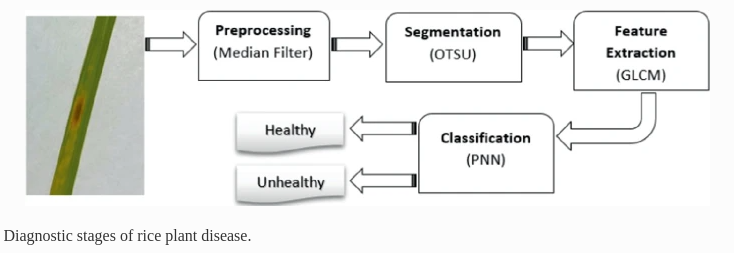

# rice_leaf_disease

Demo - <a href="https://youtu.be/gOONYNS6o9s">Demonstration</a>

The dataset includes 40 images per each disease --> 120 unhealthy images
and 148 images for healthy rice leaves

Then the paper goes through the following steps,

1. Image preprocessing

Median filtering with a 3 x 3 median filter
<pre><code>
img_color = cv2.imread(sample_img)
img = cv2.cvtColor(img_color, cv2.COLOR_BGR2GRAY)
median_applied = cv2.medianBlur(img, 3)
</code></pre>

2. Image segmentation

The OTSU method converts the image to black and white / binary image. They haven't clearly speicified the threshold but using the OTSU it returns the best threshold values and uses it in the segmentation. 
<pre>
<code>
ret, thresh1 = cv2.threshold(median_applied, 0, 255, cv2.THRESH_BINARY + 
                                            cv2.THRESH_OTSU)   
print("Threshold value is :" , ret)
cv2.imwrite("otsu_image.pgm",thresh1)
</code>
</pre>

3. Feature extraction (Texture Analysis)

Using GLCM 
- A feature extraction method by M. Haralick; used to extract features of a grayscale images. 
Eventhough they have noted that in this study they have extracted 20 features; Hararlick has only noted 14 textures. 

<a href=https://www.ncbi.nlm.nih.gov/pmc/articles/PMC8176538/>Gray level co-occurrence matrix (GLCM) texture based crop classification using low altitude remote sensing platforms</a> , This paper has noted that when using all features it results in redundant features. Therefore we can narrow it down to the mostly used features in papers using GLCM,

<pre>
<code>
contrast = greycoprops(glcm, 'contrast')
dissimilarity = greycoprops(glcm, 'dissimilarity')
homogeneity = greycoprops(glcm, 'homogeneity')
energy = greycoprops(glcm, 'energy')
correlation = greycoprops(glcm, 'correlation')
ASM = greycoprops(glcm, 'ASM')
</code>
</pre>

4. PNN
The PNN in the paper is not speicified, therefore I thought of using grid seacrh.
